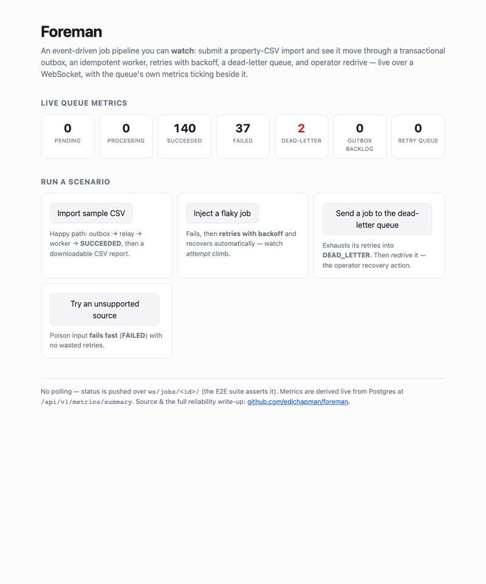
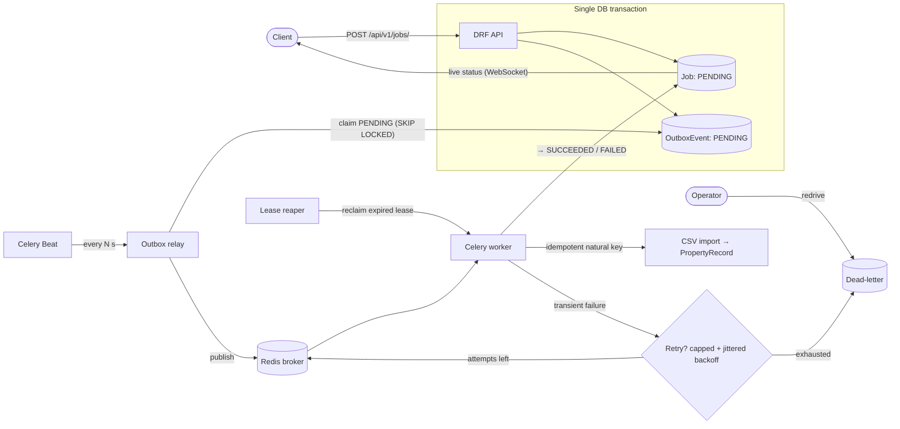
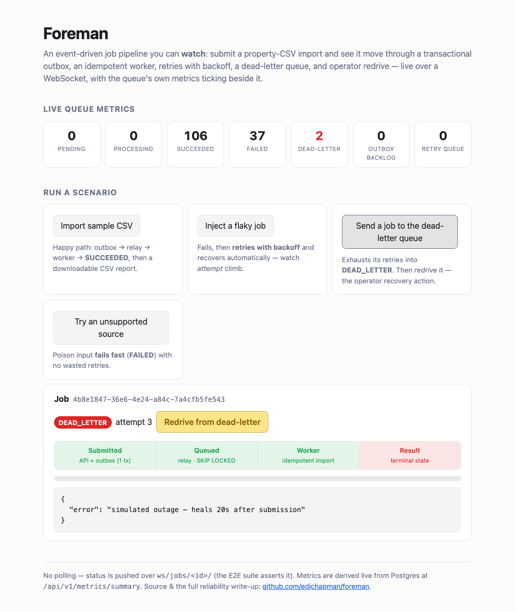
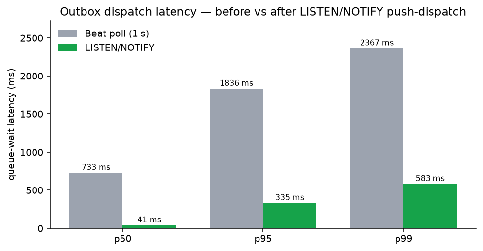

# Foreman

[](https://github.com/edjchapman/foreman/actions/workflows/ci.yml)
[](https://codecov.io/gh/edjchapman/foreman)
[](https://securityscorecards.dev/viewer/?uri=github.com/edjchapman/foreman)
[](https://github.com/edjchapman/foreman/releases)
[](pyproject.toml)
[](LICENSE)

**Event-driven job-processing platform** demonstrating backend **reliability engineering beyond CRUD**: submit a property-CSV import and the API records it atomically with a **transactional outbox**, **idempotent workers** process it with **retries and a dead-letter path**, progress streams live over **WebSockets**, and the records come back as a **downloadable CSV report**. It's a portfolio project and it's **live**: [**foreman-demo.up.railway.app**](https://foreman-demo.up.railway.app). The full engineering narrative is the [**case study**](docs/case-study.md).

## Contents

- [Live demo](#live-demo)
- [Architecture](#architecture)
- [Reliability model](#reliability-model)
- [Proven under load](#proven-under-load)
- [Quickstart](#quickstart)
- [API](#api)
- [Engineering practices](#engineering-practices)
- [Development](#development)
- [License](#license)

## Live demo

[Open the demo](https://foreman-demo.up.railway.app) and drive the pipeline yourself — each scenario streams **live over a WebSocket** (no polling — the [E2E suite](e2e/test_demo_page.py) asserts it), with the queue's own metrics ticking beside it:

- **Import sample CSV** — the happy path to `SUCCEEDED` + a downloadable report.
- **Inject a flaky job** — a transient failure that retries with backoff and recovers on its own.
- **Send a job to the dead-letter queue** — retries exhaust into `DEAD_LETTER`; **redrive** it and watch it heal.
- **Try an unsupported source** — poison input fails fast, no wasted retries.



## Architecture



The **outbox** decouples submission from dispatch, the **relay** is a dumb publisher that never re-reads the job, and the **worker** owns idempotency, retries, and terminal state ([ADR 0001](docs/adr/0001-transactional-outbox.md), [ADR 0002](docs/adr/0002-retries-dlq-lease.md)). The job **state machine**, the **sequence diagram** of the full flow, and the **crash-recovery / lease-fencing race** are in [**docs/architecture.md**](docs/architecture.md).

## Reliability model

| Concern | Guarantee | Mechanism |
|---|---|---|
| Publish | **No dual-write** | Job + `OutboxEvent` commit in one transaction; a Beat relay publishes the outbox. |
| Delivery | **At-least-once** | The relay re-sends after a crash between publish and mark-dispatched. |
| Effect | **Exactly-once** | Per-job natural key + `bulk_create(ignore_conflicts=True)` — reprocessing converges, never duplicates. |
| Transient failure | **Retry, then dead-letter** | Capped full-jitter exponential backoff; dead-letter after `JOB_MAX_ATTEMPTS`; operator `redrive`. |
| Poison input | **Fail fast** | An `IngestError` goes straight to `FAILED` with no retries. |
| Worker crash | **Lease + reaper recovery** | An expired lease is reclaimed; a fencing token discards a resumed zombie's stale write. |
| Concurrency | **Non-blocking claims** | `SELECT … FOR UPDATE SKIP LOCKED` (PostgreSQL). |

Failure modes and the crash-window analysis are in [ADR 0002](docs/adr/0002-retries-dlq-lease.md); the [demo page](https://foreman-demo.up.railway.app) drives these states on purpose:



## Proven under load

The guarantees are **measured, not asserted**: a [Locust harness](load/) drives the real pipeline while Prometheus counters and histograms on `/metrics` observe it ([ADR 0006](docs/adr/0006-load-testing-metrics.md)). The baseline showed queue wait — not processing — dominated latency, so dispatch moved to **Postgres `LISTEN/NOTIFY` push** with Beat as fallback ([ADR 0007](docs/adr/0007-listen-notify-dispatch.md)): queue-wait **p95 fell ~5.5×** (1.84 s → 0.34 s) and end-to-end p95 halved, at ~40 jobs/s with **zero failures** throughout.



Full method, PromQL, and the complete before/after tables: [**docs/load-testing.md**](docs/load-testing.md).

## Quickstart

Full stack with Docker:

```bash
make up          # full stack + live demo UI at http://localhost:8000
```

On the host with [uv](https://docs.astral.sh/uv/) (no Docker — reads `DATABASE_URL` from your env, see `.env.example`):

```bash
uv sync
make migrate
make test
uv run python manage.py runserver
```

Submit and track a job:

```bash
curl -X POST localhost:8000/api/v1/jobs/ \
  -H 'Content-Type: application/json' \
  -d '{"job_type": "property_csv_import", "payload": {"source": "sample:properties.csv"}}'

curl localhost:8000/api/v1/jobs/<id>/
curl -OJ localhost:8000/api/v1/jobs/<id>/report/   # download the imported records (CSV)

# stream a job's live status (needs websocat)
websocat ws://localhost:8000/ws/jobs/<id>/
```

The default sample source (`sample:properties.csv`) resolves to a bundled fixture, so a job runs end-to-end with no external storage — watch it move `PENDING → PROCESSING → SUCCEEDED`.

## API

The current API is `v1`:

| Method | Path | Purpose |
|--------|------|---------|
| `POST` | `/api/v1/jobs/` | Submit a job → `202 Accepted` with id + `Location`. Honours an `Idempotency-Key` header. |
| `GET` | `/api/v1/jobs/{id}/` | Job status, progress, result, error. |
| `GET` | `/api/v1/jobs/` | List jobs (paginated). |
| `GET` | `/api/v1/jobs/{id}/report/` | Download the imported records as CSV (streamed; `409` until `SUCCEEDED`). |
| `POST` | `/api/v1/jobs/{id}/redrive/` | Redrive a dead-letter job (`409` unless it's `DEAD_LETTER`). |
| `GET` | `/healthz` | Liveness — the process is up (no dependency I/O). |
| `GET` | `/readyz` | Readiness — database + broker reachable (`503` if not). |
| `GET` | `/metrics` | Prometheus metrics — queue depth, dispatch lag, dead-letter count. |
| `GET` | `/api/v1/metrics/summary` | JSON queue snapshot — powers the demo's live strip. |
| `WS` | `/ws/jobs/{id}/` | Live status/progress stream — snapshot on connect, then deltas. |

## Engineering practices

The repo is operated like a production service:

- **CI gates** (required on `main`): ruff, `mypy --strict`, pytest at a **90% coverage floor** against real PostgreSQL, plus a docs/link gate — `make preflight` runs it all locally. Pipeline diagram: [docs/ci.md](docs/ci.md).
- **Security & supply chain**: CodeQL, dependency review, scheduled `pip-audit`, SHA-pinned actions, digest-pinned base image, SLSA provenance on release images — graded by [OpenSSF Scorecard](https://securityscorecards.dev/viewer/?uri=github.com/edjchapman/foreman).
- **Automated releases & deploys**: Conventional Commits drive release-please → versioned GHCR image → Railway deploy with the semver tag pinned ([docs/deploy.md](docs/deploy.md)); the platform itself is Terraform-provisioned ([ADR 0005](docs/adr/0005-deployment-platform.md)).
- **Operability**: structured JSON logs, split liveness/readiness probes, an operator [runbook](docs/runbook.md), and decisions captured as [ADRs](docs/adr/README.md).

Built in five milestones (walking skeleton → outbox → reliability → realtime + observability → ship), all delivered — the narrative, and what I'd build next, are in the [case study](docs/case-study.md).

## Development

`make help` lists every target; **`make preflight`** runs the full pre-PR gate (lint + types + tests + audit + docs). Worker/relay run locally via `make worker` / `make beat` (or `make relay` for a one-shot dispatch).

Contributions follow [Conventional Commits](https://www.conventionalcommits.org) (the PR title is enforced and becomes the squash-merge subject). See [CONTRIBUTING.md](CONTRIBUTING.md).

## License

[MIT](LICENSE) © Ed Chapman.
