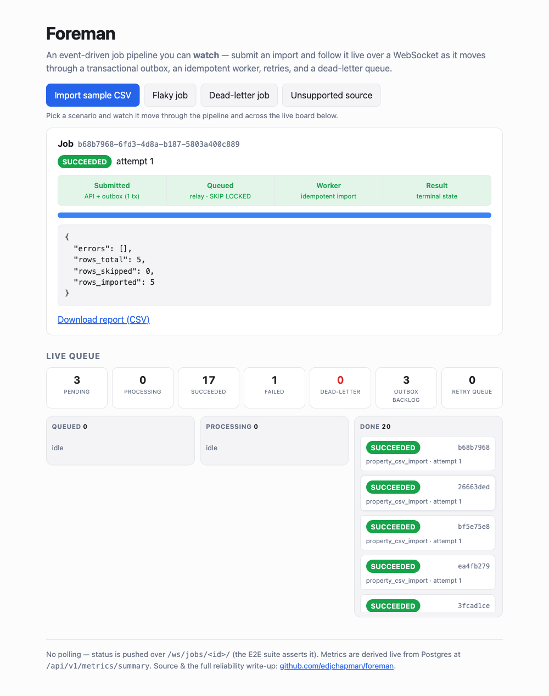
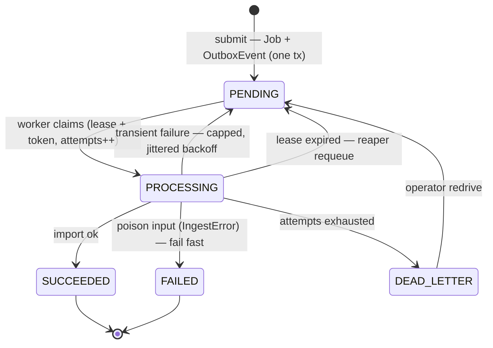
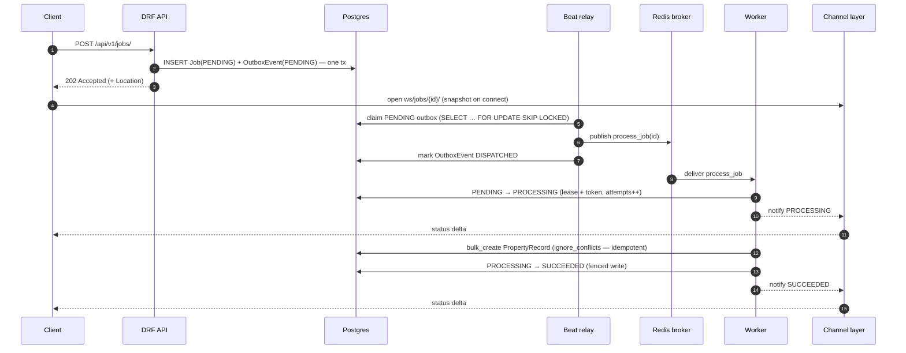
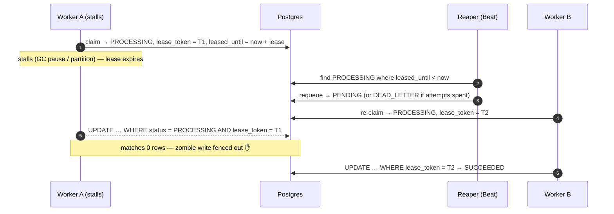

# Architecture diagrams

Visual companions to the [case study](case-study.md) and the [ADRs](adr/README.md).
The README has the system-level [flowchart](../README.md#architecture); this page
adds the three views that make the *reliability* behaviour legible: the job state
machine, the happy-path message flow, and the crash-recovery race.

The [demo page](https://foreman-demo.up.railway.app) lets you drive the pipeline
and watch a job move through it live — here a sample import has reached
`SUCCEEDED`, with the queue's own metrics ticking above:



## Job state machine

Every job is a row whose `status` walks this machine. Retries and lease recovery
are the two edges back to `PENDING`; `redrive` is the operator's edge back from
the dead-letter state. Terminal states are never left (barring `redrive` or
retention pruning), which is also what makes the DB-derived counters monotonic
(see [ADR 0006](adr/0006-load-testing-metrics.md)).



See [ADR 0002](adr/0002-retries-dlq-lease.md) for the failure taxonomy (transient
vs poison), the backoff schedule, and why retry state lives in Postgres.

## Happy-path message flow

The **outbox** decouples submission from dispatch: the API only writes rows, a
Beat-scheduled relay publishes them, and the worker owns processing. No component
re-reads a job it might race. Status reaches the browser over a WebSocket —
pushed, never polled (the [E2E suite](../e2e/test_demo_page.py) asserts it).



See [ADR 0001](adr/0001-transactional-outbox.md) (outbox) and
[ADR 0004](adr/0004-realtime-websockets.md) (the single sync→async broadcast seam).

## Crash recovery: the lease + fencing-token race

The hardest case is a worker that stalls *without dying* — a long GC pause or a
network partition — so its job looks stuck but the process may still resume. A
lease bounds how long a claim is trusted; the reaper reclaims an expired lease;
and a **fencing token** guarantees the resumed zombie can't clobber the row the
new worker now owns. Every post-claim write is `… WHERE status = PROCESSING AND
lease_token = <ours>`, so a stale writer matches zero rows.



The residual crash windows (and why they're an accepted property of at-least-once
delivery, not a bug) are analysed in [ADR 0002](adr/0002-retries-dlq-lease.md).

## Observability at a glance

The same states drive the metrics. `GET /metrics` is computed live from Postgres
at scrape time (cross-container-true; see [ADR 0003](adr/0003-observability.md)),
so the queue's golden signals — including **dead-letter depth** — are always
reportable without any process-local counters:

```text
foreman_jobs{status="PENDING"} 0.0
foreman_jobs{status="PROCESSING"} 0.0
foreman_jobs{status="SUCCEEDED"} 32.0
foreman_jobs{status="FAILED"} 5.0
foreman_jobs{status="DEAD_LETTER"} 3.0
foreman_outbox_pending 0.0
foreman_outbox_oldest_pending_age_seconds 0.0
foreman_jobs_retry_scheduled 0.0
```

The demo page reads the human-readable JSON form of the same query
(`GET /api/v1/metrics/summary`) for its live metrics strip. Alert thresholds and
the PromQL for throughput/latency are in the [runbook](runbook.md).
